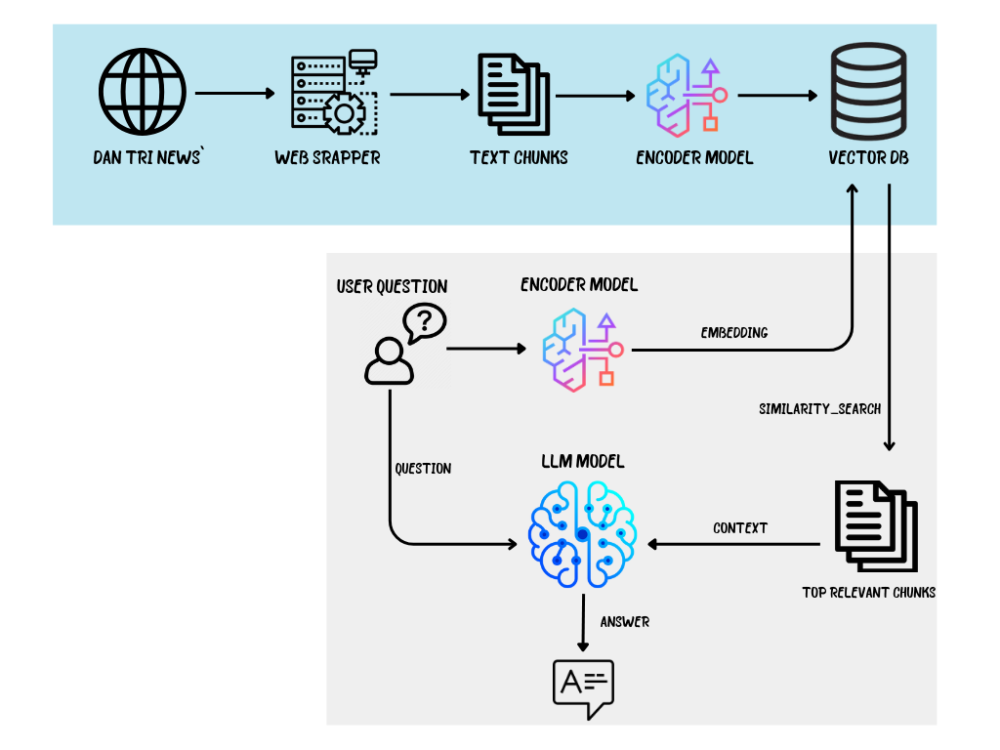

# 🛡️ AI Chatbot News Buddy

## 📌 Overview
This project is an AI-powered news reading assistant designed for both end-users and internal editorial teams of a digital news platform.

- For readers, it serves as a conversational news assistant, helping users discover and engage with personalized news articles based on their interests, reading history, and real-time queries.

- For editorial and content teams, it powers a semantic tagging and user intent classification pipeline, enabling better content curation, audience segmentation, and data-driven content strategies.

The chatbot integrates Google Gemini for natural language conversations and a custom fine-tuned semantic similarity model to ensure that article recommendations are context-aware, timely, and tailored to each reader’s preferences.

---

## ✅ Core Features

### 1. 🔍 AI Chatbot (Main Feature)

- Conversational interface that helps users explore and understand news content through chat.

- Integrated with Gemini API (Google Generative Language) to provide natural, human-like replies.

- Prompting logic is enhanced with metadata from news articles (e.g., topics, categories, timestamps).

- Custom semantic similarity model aligns user queries with the most relevant news articles.

### 2. 🏷️ CRM Tagging Pipeline (Main Feature)

- Utilizes an internal semantic model to extract key intent tags from user queries.

- Tracks tag frequency per user to build behavioral profiles.

- Logs interactions in MongoDB (TagLog) to support personalization and trend analysis.

- The most frequent tag is matched with a curated news dataset (news.json) to refine future article recommendations and audience segmentation.

---

## 🎯 Target Audience

- News readers seeking personalized, on-demand access to articles based on their interests and reading habits.

- Non-technical users who prefer a conversational interface to explore news instead of navigating complex menus or categories.

- Editorial and content strategy teams using chatbot interaction logs and tag analytics to understand audience behavior and optimize content planning.

## 🏗️ Architecture

- **Frontend**: React (ShadCN UI + TailwindCSS).
- **Backend**: Python (FastAPI).
- **Database**: Milvus (Vector Database) + MongoDB
- **AI Services**:
  - Google Gemini API.
  - Local Semantic Search Model (MODEL: vietnamese-embedding). (Link: https://huggingface.co/dangvantuan/vietnamese-embedding)

## Architecture Diagram ##
  

---

## ✅ What Worked

Gemini responds fluently with contextual coherence.

Combining Gemini + tag-based similarity produces more relevant suggestions.

CRM pipeline lets consultants understand repeated interests.

## ⚠️ Challenges

Local similarity model was too naive on surface-level keywords.

Data like "premium" or "children" were matched incorrectly.

Confidence score did not correlate well with intent.

## ☑️ Next Improvements

Integrate usage analytics

Add customer intent classification

Explore fine-tuned Gemini on internal corpus

---

## 👥 Team Members

| Role               | Name             | Responsibilities                                                                 |
|--------------------|------------------|----------------------------------------------------------------------------------|
| 🧠 **Fullstack Developer** | **Tran Minh Khang** | - Frontend Design - Gemini API integration - Semantic similarity model |
| 🎨 **Artist** | **Ha Thai Toan**   | - Chat UI/UX 
| 🛠️ **Backend Developer** | **Le Hoang Viet**   | - RESTful API & routing - Pipeline coordination    |

---

**End of README**

